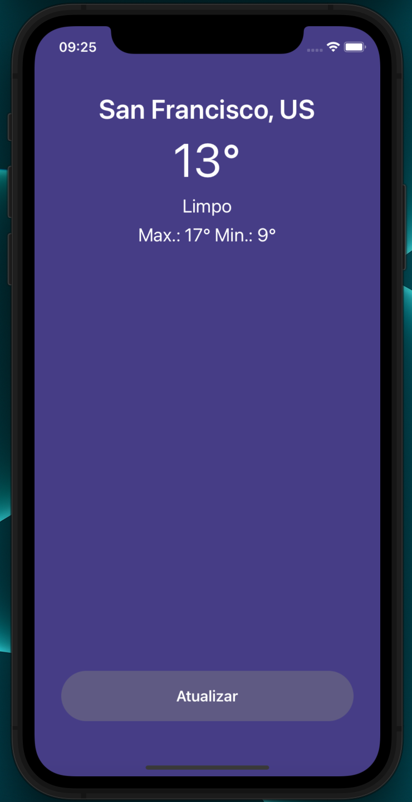

# Desafio ClimaTempo

App tem como finalidade mostrar o clima atual no local que o usuário se encontra

## Como instalar

Baixe o repositório e instale as dependências do projeto
 

> npm install

 

## Configuração

Criar arquivo .env e adicionar a seguinte propriodade

> WEATHER_API_KEY={API Key of OpenWeather}

 

## IOS 

Para executar no ios realize os seguintes comandos

> cd ios && pod install

> react-native run-ios

 

## Android

Lembre-se de adicionar o arquivo "local.properties" e adicionar o caminho do sdk

No arquivo local.properties adicionar sdk.dir={local do arquivo do sdk}

> react-native run-android

 

## Prints Screens

Nosso App contém dois themas de acordo com o sistema de cores do smartphone:

#### Light

 

#### Dark

